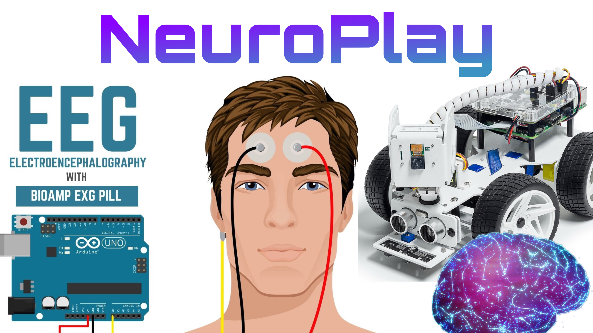

  

# 🧠 NeuroPlay: Gaming with Brainwaves
Control a robot car **with your brain** using EEG signals, machine learning, and real-time robotics.  
This project combines **biosignal processing**, **ML classification**, and **embedded systems** into one cohesive, magical experience.

## What This Project Does

NeuroPlay reads EEG signals from the **BioAmp EXG Pill**, detects mental states like   
**🟢 focus**, **🔴 unfocus**, and ** blinks**,  
and sends commands over TCP to a Raspberry Pi–powered **PiCar-X**.

The result?  
You move the car **just by thinking.**

## System Architecture

BioAmp EXG Pill → Arduino → Python ML Interpreter → TCP Socket → Raspberry Pi → PiCar-X Motors

## ✨ Features

- Real-time EEG brainwave streaming  
- KNN-based classification of focused / unfocused mental state  
- Blink detection  
- TCP communication pipeline  
- Robot control (forward, stop, optional turns)  
- Smoothing to avoid jitter or accidental spikes  

## 🧱 Tech Stack

**Hardware**
- BioAmp EXG Pill  
- Arduino Uno  
- Raspberry Pi 5  
- PiCar-X Robotics Kit  

**Software**
- Python  
- NumPy, SciPy, scikit-learn  
- Socket networking  
- Arduino IDE  
- PiCar-X Python API  

## 👩‍🚀 Team & Vision

NeuroPlay is built to make neurotechnology fun, accessible, and empowering for students and creators.
Using affordable hardware and approachable ML, we turn brainwaves into real-world actions.
